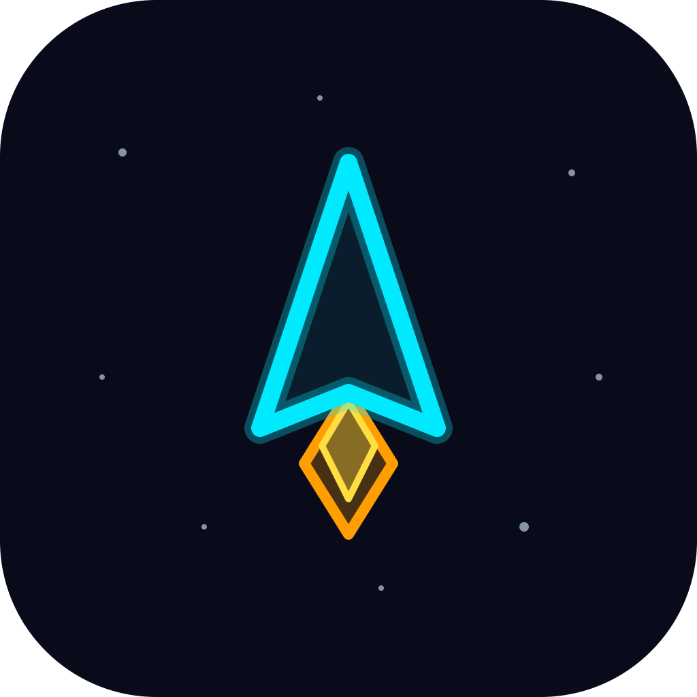
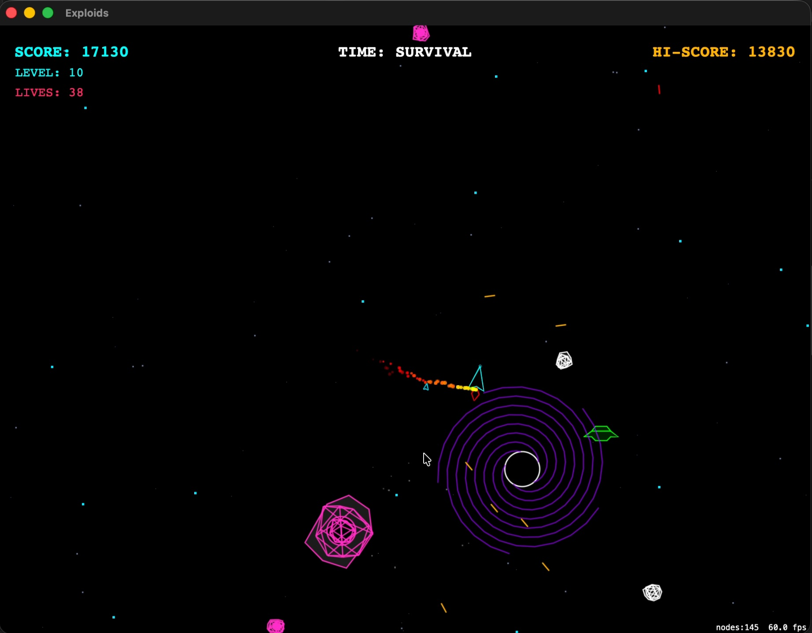
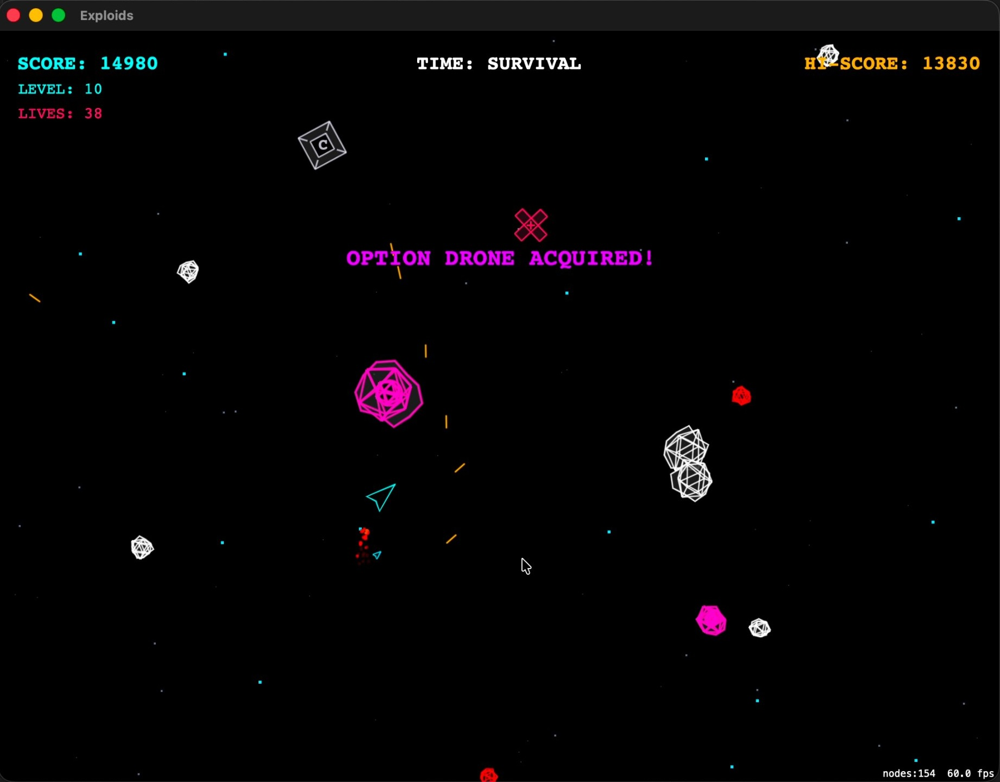
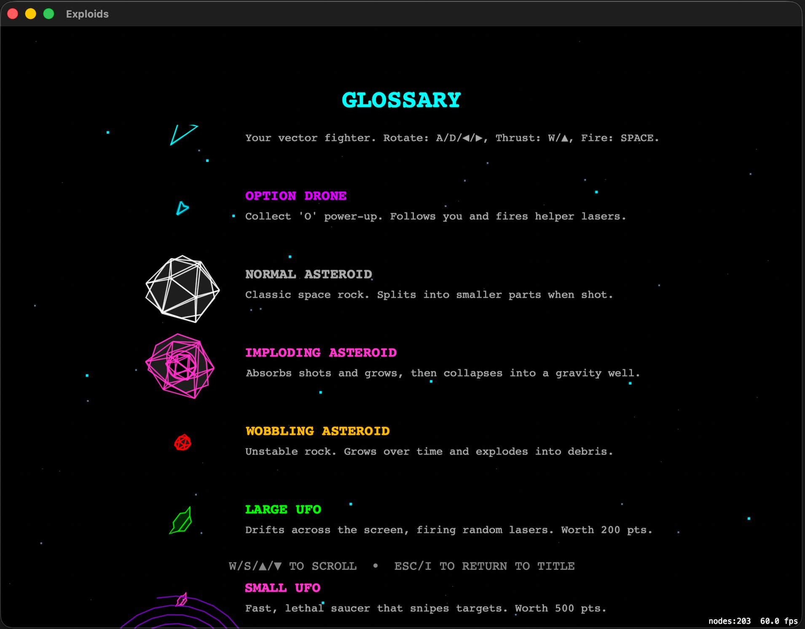
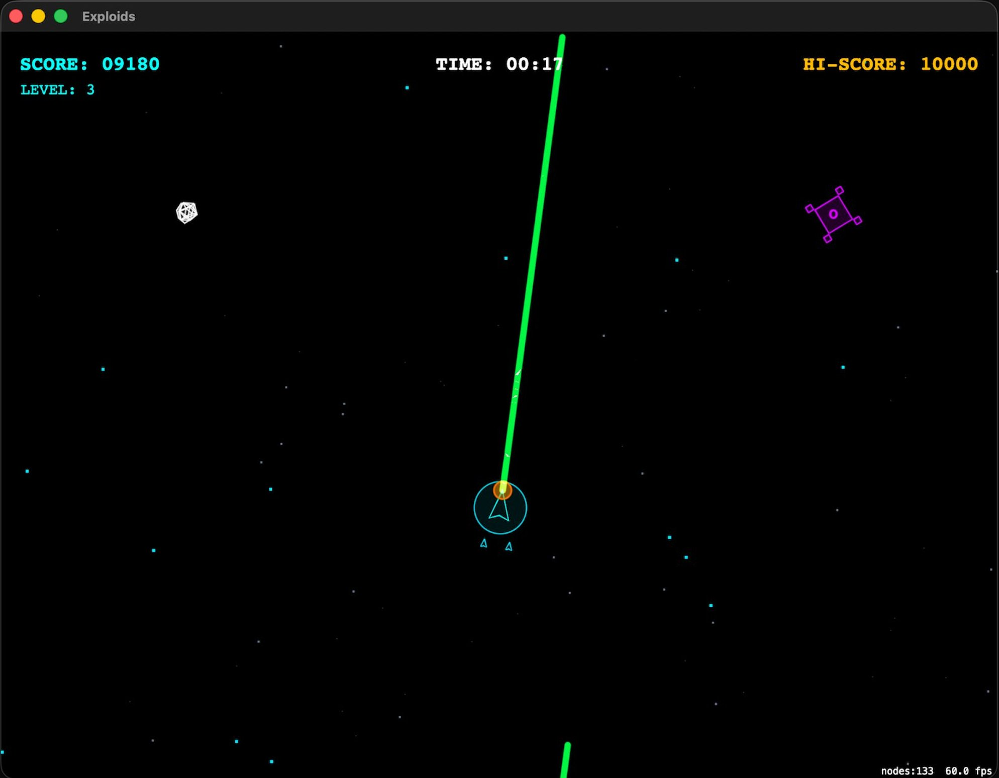
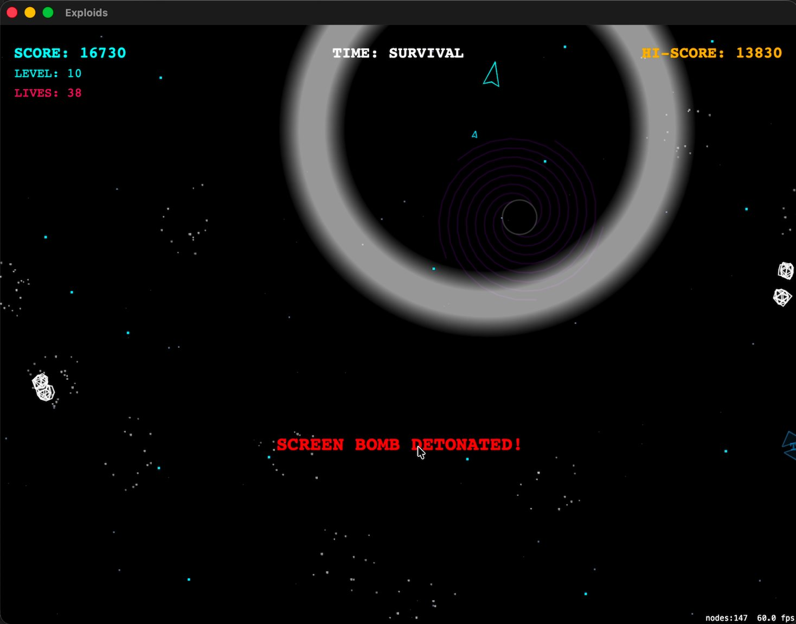

# Exploids

**🌐 Sprache / Language:** [English](README.md) · [Deutsch](README.de.md)

<p align="center"></p>

Ein nativer macOS-Arcade-Shooter im Asteroids-Stil (Swift 6 · SpriteKit) mit einem an den Commodore 64 angelehnten Vektor-Look — in moderner hoher Auflösung und butterweicher Bildrate (Apple Silicon, ProMotion 120 Hz). Fast jede Grafik ist prozedurale Vektor-Geometrie — nur die beiden Bosse nutzen getracte Vektor-Konturen als Texturen — und jeder Soundeffekt wird in Echtzeit synthetisiert; mitgeliefert sind zwei Chiptune-Musikstücke, die Boss-Texturen und ein optionales Paket aufgenommener Soundeffekte. Zwei Spielmodi, neun Power-Ups, Gravitationsfelder, gegnerische UFOs, zwei Bosse, ein Pixel-Font-HUD und ein deterministisches Replay-System, das Promo-GIFs headless rendern kann.

> Der Text im Spiel ist auf Englisch.

## Download

**[➜ Aktuelles signiertes & notarisiertes DMG herunterladen](https://github.com/DanielMuellerIR/exploids/releases/latest)** — öffnen, *Exploids* in den Programme-Ordner ziehen und doppelklicken. Mit Developer ID signiert und von Apple notarisiert, öffnet also ohne Gatekeeper-Warnung. Benötigt macOS 14 oder neuer (Apple Silicon).

Lieber selbst aus dem Quellcode bauen? Siehe [Bauen & starten](#bauen--starten-kommandozeile--headless-tauglich) weiter unten.

## Screenshots

<p align="center"></p>

| Option-Drohne + Schild | Glossar im Spiel |
|:--:|:--:|
|  |  |
| **Laserstrahl** | **Gravitationsfeld + Bombe** |
|  |  |

## Bauen & starten (Kommandozeile / headless-tauglich)

Kein Xcode-Projekt — ein Swift-Package-Manager-Executable, das zu einem `.app`-Bundle kompiliert wird. Die gesamte Toolchain ist skriptbar (praktisch für Automatisierung und KI-Agenten):

```bash
./build-app.sh                                   # baut -> Exploids.app (doppelklickbar)
open Exploids.app                                # starten
.build/release/exploids                          # nackte Binary starten (Logs im Terminal)
DEVELOPER_DIR=/Applications/Xcode.app/Contents/Developer swift test   # die 90 Unit-Tests laufen lassen
```

### Signiertes + notarisiertes DMG

```bash
bash wrappers/sign-and-release.sh                # -> build/Exploids-<version>.dmg, Gatekeeper-sauber
bash wrappers/sign-and-release.sh --publish      # setzt zusätzlich Tag + lädt das DMG zu GitHub Releases
```

## Spielmodi

Auswahl im Startbildschirm (▲/▼ wechseln, ◀/▶ für den Startlevel, Leertaste startet):

- **Ancient Asteroids** — der klassische Modus. Festes Spielfeld; Objekte laufen über die Bildschirmränder hinaus und kommen gegenüber wieder herein.
- **Mad Meteoroids** — das gesamte Feld (Asteroiden, Gravitationsfelder, Power-Ups, Sternenhimmel) rotiert fortlaufend um die Bildschirmmitte, während das Schiff ausgenommen bleibt (Crazy-Comets-Stil). Die Rotationsgeschwindigkeit steigt mit dem Level, mit geplanten Richtungswechseln und gelegentlichen „Record-Scratch"-Rucklern in höheren Leveln.

## Power-Ups

Neun Aufsammler, jeder mit eigenem Vektor-Symbol:

| Symbol | Power-Up | Wirkung |
|:--:|--|--|
| `S` | Schild | Energieschild fängt einen Treffer ab |
| `W` | Streuschuss | Dreifacher Fächer-Schuss |
| `R` | Schnellfeuer | Stark erhöhte Feuerrate |
| `O` | Option | Eine Satelliten-Drohne feuert mit |
| `B` | Bombe | Bildschirmräumende Explosion |
| `L` | Laserstrahl | Halten für einen sweependen, randumlaufenden Strahl |
| `T` | Heck | Zusätzlicher Schuss nach hinten |
| `C` | Kompress | Schrumpft das Schiff auf ~30 % (kleineres Ziel) |
| `+` | Extra-Leben | Wiederbelebung mittig mit kurzer Unverwundbarkeit |

## Gegner & Bosse

Über die splittenden Brocken hinaus füllt sich das Feld, je höher der Level:

- **Gegnerische UFOs** — ein großes grünes UFO, das in zufällige Richtungen feuert, und ein kleines pinkes, das gezielt auf das Schiff schießt. Beide gleiten mit leichtem Sog in Richtung Spieler herein.
- **Gravitationsfelder** — Schwarze Löcher, die den Raum verzerren, alles nach innen ziehen und das Schiff bei Berührung zermalmen.
- **Implodierende Asteroiden** — magenta umrandete Brocken, die beim Abschuss zu einem frischen Gravitationsfeld kollabieren.
- **Wobble-Bomben** — rote Brocken, die pulsieren, in Stufen wachsen und dann in einen Fächer schneller Splitter detonieren.
- **Weltraumkatze** — ein pirschender Boss, der hinter Asteroiden in Deckung geht, deine Bewegung vorhält und mit Zwillings-Augenstrahlen feuert; drei Treffer vertreiben sie.
- **Das Idol** — ein großer schwebender Steinkopf, der hereingleitet, deinen Schüssen ausweicht und eine Armada UFOs aus dem Mund speit; zehn Treffer zerstören ihn.

## Steuerung

- **Startbildschirm:** ▲/▼ Spielmodus wechseln · ◀/▶ (oder A/D) Startlevel wählen · Leertaste/Enter starten · I Glossar · 1–5 ein Highscore-Replay ansehen
- **Im Spiel:** Pfeiltasten / WASD zum Fliegen · Leertaste zum Schießen (halten zum Aufladen / Strahl sweepen) · M Musik an/aus · Esc Pause / Beenden
- **Replay-Ansicht:** Esc verlässt das Replay zurück zum Startbildschirm.
- Highscores werden lokal gespeichert; bei einer Platzierung den Namen auf der Liste eintragen.
- **Cheat:** Taste `#` gibt ein Extra‑Leben — praktisch zum Testen oder für einen entspannten Durchlauf ohne Herausforderung.

## Replay & GIF-Export

Die Simulation ist **deterministisch**: Jeder Durchlauf wird allein als Seed plus deine Tastendrücke aufgezeichnet und lässt sich dadurch bit-genau reproduzieren. Daraus folgen zwei Dinge:

- **Highscore-Läufe erneut ansehen** — im Startbildschirm `1`–`5` drücken, um den Eintrag exakt so abzuspielen, wie er gespielt wurde; `Esc` verlässt ihn.
- **Promo-GIFs headless rendern** — ein Replay direkt auf der Kommandozeile in ein sauberes, cursorfreies animiertes GIF verwandeln, ganz ohne Fenster:

```bash
exploids --render-demo --out demo.gif            # skriptgesteuerter Demo-Lauf -> GIF (Pipeline-Selbsttest)
exploids --export-replay 0 --out run.replay      # Replay von Highscore-Eintrag #0 in eine Datei exportieren
exploids --render-replay run.replay --out run.gif --scale 480 --fps 30
```

## Einordnung

Exploids ist ein Hobby-Klon, kein Produkt. Zur ehrlichen Einordnung, Schwachstellen ausdrücklich eingeschlossen:

**Gegenüber dem Original-Asteroids (1979)** — das Original ist monochrome Vektorgrafik mit splittenden Brocken, zwei Untertassen, Hyperspace und einem Extra-Leben bei 10.000 Punkten. Exploids behält diesen Kern und ergänzt einen zweiten, rotierenden Modus (Mad Meteoroids), neun Power-Ups, Gravitationsfelder, imploding- und wobbling-Spezialasteroiden, zwei Bosse, einen Ladeschuss und einen sweependen Laserstrahl, Farbe, Chiptune-Musik, ein In-Game-Glossar, lokale Highscore-Eingabe und deterministische Replays, die sich erneut ansehen oder als GIF exportieren lassen.

**Gegenüber Maelstrom** — [Maelstrom](https://github.com/libsdl-org/Maelstrom) (Ambrosia, 1992; seit 1995 GPL-SDL-Port, heute ein SDL2/SDL3-Build, der auf Apple Silicon läuft) ist der bekannteste noch gepflegte Open-Source-Asteroids-Klon für den Mac und der fairere Maßstab: Power-Ups, Bonus-Objekte und satten Sound hat er bereits. Worin sich Exploids tatsächlich unterscheidet:

- **Rendering:** Exploids ist prozedural gezeichnete Echtzeit-*Vektor*-Geometrie in hoher Auflösung und mit 120 Hz ProMotion; Maelstrom ist Bitmap-/Sprite-Rastergrafik.
- **Audio:** Exploids synthetisiert die Soundeffekte live auf dem Audio-Thread (nur die zwei Musikstücke sind Dateien); Maelstrom spielt Samples ab.
- **Mechaniken:** der rotierende Mad-Meteoroids-Modus, Gravitationsfelder und imploding-Asteroiden sind Exploids-spezifisch.
- **Stack:** nativ Swift 6 / SpriteKit / AppKit auf Apple Silicon statt eines C/SDL-Ports.

**Wo Maelstrom klar vorn liegt:** Ein- *und* Mehrspieler (kooperativ und kompetitiv), Gamepad- und Touch-Steuerung, läuft auf mehr Plattformen und trägt 30 Jahre Feinschliff und Community. Exploids ist Einzelspieler, vorrangig Tastatur und macOS-Desktop (ein iOS-Touch-Target ist ein frühes Work in Progress) und jung. Außerdem bringt es nicht-kommerzielle Musik mit (siehe unten) — eine Einschränkung, die Maelstroms CC-lizenzierte Assets nicht haben.

## Lizenzen

- **Code:** [MIT](LICENSE) — © 2026 Daniel Müller.
- **Überschriften-Font** `Sources/GameCore/Fonts/PressStart2P-Regular.ttf` (Press Start 2P): **SIL Open Font License 1.1** (`Sources/GameCore/Fonts/OFL.txt`) — frei für jede Nutzung, auch kommerziell.
- **⚠️ Musik** `Sources/GameCore/Music/*.mp3` (zwei Chiptune-Stücke): erzeugt mit **[musely.ai](https://musely.ai)** im Free Plan — **nur persönliche, nicht-kommerzielle Nutzung**. Diese Stücke fallen **nicht** unter die MIT-Code-Lizenz und behalten die separaten Bedingungen von musely.ai. Vor jeder kommerziellen Nutzung durch eigene / CC0 / kommerziell lizenzierte Musik ersetzen. Alle anderen Klänge werden zur Laufzeit synthetisiert (keine Drittrechte).

## iOS-Target (Work in Progress)

Das Repo enthält außerdem ein iOS-App-Target unter `ios/` (SpriteKit + Touch-Steuerung auf dem Bildschirm), das dieselbe `GameCore`-Engine wie der macOS-Build einbindet. Es ist ein junges Work in Progress und noch nicht veröffentlicht.

## Voraussetzungen

macOS **14+**, Apple Silicon. Zum Bauen: eine vollständige Xcode-Installation (die Skripte nutzen `DEVELOPER_DIR=/Applications/Xcode.app/...` für die SpriteKit-/XCTest-Toolchain).

---

*Status: privates Projekt — eine prozedurale Vektor-Hommage an den Asteroids-Arcade-Klassiker von 1979, ohne übernommenen Code oder Assets.*
